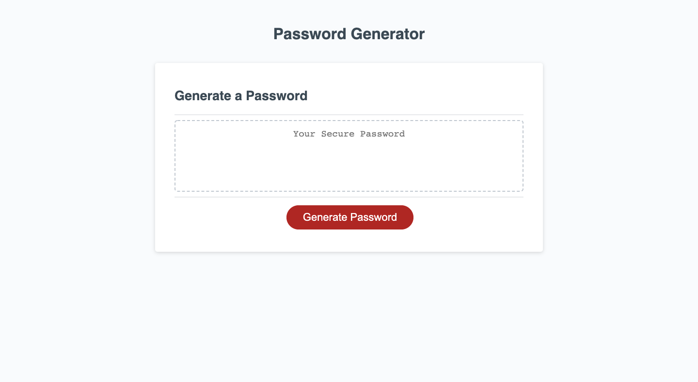

# Password-Generator

## **Description**

Making a password generator that meets certain criteria to create strong passwords for security using JavaScript and Web APIs.

**HTML and CSS**

Starter codes for HTML and CSS has been provided.

**JavaScript**

Created two functions to build a password generator. Utilized 4 different character types (lowercase, uppercase, numeric and special characters) to build my character pool. Validated inputs such that password length must be between 8 through 128 and at least one character type is confirmed. After the character pool is built, it will then be looped through randomly until the password length is met.

## **Screenshot**

## **Github Page Link**

[Link to Github Page!](https://bchen41.github.io/Password-Generator/)

Author: Betty Chen
